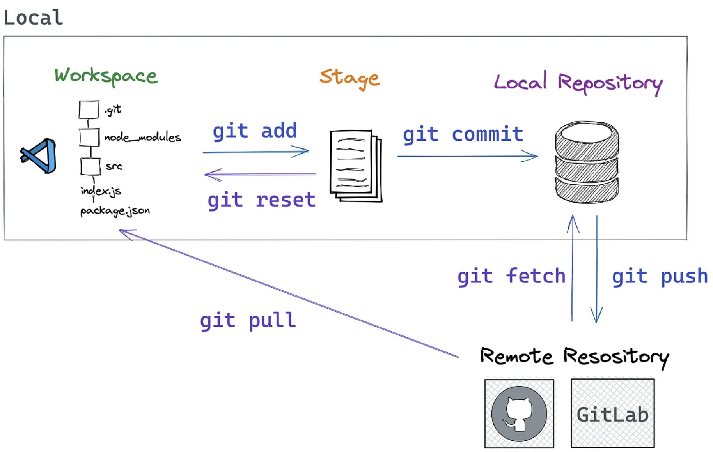
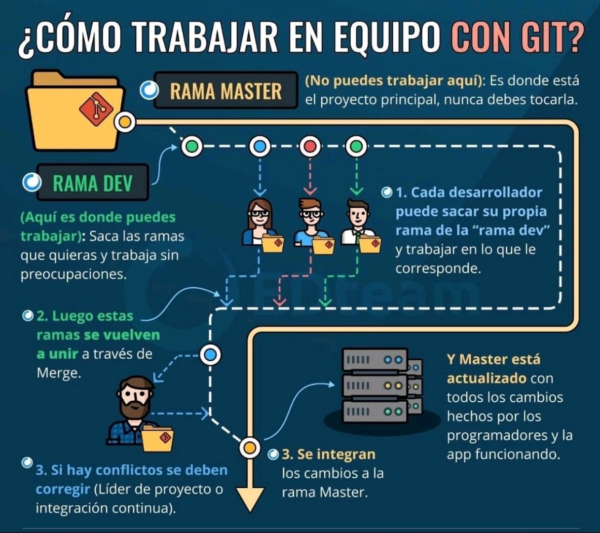

# Git y GitHub para Principiantes

Este repositorio está diseñado para ayudar a los principiantes a entender y utilizar Git y GitHub de manera efectiva. Aquí aprenderás los conceptos básicos, comandos esenciales y cómo integrar tu trabajo con GitHub.

## 📌 Contenido

- Introducción a Git y GitHub
- Instalación de Git
- Configuración inicial
- Comandos básicos de Git
- Trabajando con ramas (branches)
- Resolución de conflictos
- Uso de GitHub (repositorios, issues, pull requests)
- Flujo de trabajo colaborativo

## 🚩 Introducción a Git y GitHub  

Git es un sistema de control de versiones que permite gestionar el historial de cambios de un proyecto o código. Con Git, podemos hacer un seguimiento detallado de los archivos, crear ramas (branches), fusionar cambios (merge), y colaborar de forma local sin necesidad de estar conectado a Internet.

GitHub es una plataforma web que utiliza Git como sistema de control de versiones, pero además ofrece un repositorio remoto donde puedes almacenar y compartir tu código. GitHub facilita la colaboración entre desarrolladores mediante herramientas como "pull requests", "issues", revisiones de código y más.

A continuación, se muestran las principales diferencias entre **Git** y **GitHub** en una tabla comparativa:

| **Característica**            | **Git**                                         | **GitHub**                                     |
|-------------------------------|-------------------------------------------------|------------------------------------------------|
| **Tipo**                       | Sistema de control de versiones local           | Plataforma web para alojamiento de repositorios |
| **Propósito principal**        | Gestionar el historial de cambios y versiones del código | Almacenar y colaborar en proyectos de código usando Git |
| **Funcionamiento**             | Funciona localmente en tu máquina               | Funciona en línea, en la nube                   |
| **Colaboración**               | Permite trabajar de forma local, pero no tiene herramientas de colaboración integradas | Facilita la colaboración entre desarrolladores mediante "pull requests", "issues", revisiones de código, etc. |
| **Requiere conexión a Internet** | No, es completamente funcional sin conexión | Sí, necesita conexión para interactuar con los repositorios remotos |
| **Acceso remoto**              | No tiene acceso remoto a los repositorios | Proporciona acceso remoto a los repositorios desde cualquier lugar |
| **Uso principal**              | Control de versiones y gestión de cambios locales | Almacenaje remoto, gestión de proyectos y colaboración |


## 📥 Instalación de Git

Para instalar Git en tu sistema, sigue estos pasos:

### Windows
1. Descarga el instalador desde [git-scm.com](https://git-scm.com/)
2. Ejecuta el instalador y sigue las instrucciones
3. Verifica la instalación con:
   ```sh
   git --version
   ```

### macOS
Ejecuta en la terminal:
```sh
brew install git
```

### Linux (Debian/Ubuntu)
```sh
sudo apt update && sudo apt install git
```

## ⚙️ Configuración Inicial
Después de instalar Git, configura tu nombre de usuario y correo electrónico:
```sh
git config --global user.name "Tu Nombre"
git config --global user.email "tuemail@example.com"
```

## 🔹 Comandos Básicos

| Comando | Descripción |
|---------|------------|
| `git init` | Inicializa un nuevo repositorio |
| `git clone <url>` | Clona un repositorio remoto |
| `git status` | Muestra el estado de los archivos |
| `git add <archivo>` | Agrega un archivo al área de staging |
| `git commit -m "mensaje"` | Guarda los cambios con un mensaje |  
| `git fetch` | Descarga los últimos cambios del repo remoto sin fusionarlos automáticamente con tu rama local |  
| `git push origin main` | Sube los cambios al repositorio remoto |
| `git pull origin main` | Descarga los cambios del repositorio remoto |
| `git branch` | Lista las ramas disponibles |
| `git branch -r` | Lista las ramas remotas disponibles |
| `git checkout -b <rama>` | Crea y cambia a una nueva rama |
| `git merge <rama>` | Fusiona una rama con otra |

## 🔗 Integración con GitHub

1. Crea un repositorio en GitHub.
2. Conéctalo con tu repositorio local:
   ```sh
   git remote add origin https://github.com/tuusuario/repositorio.git
   ```
3. Sube tus archivos a GitHub:
   ```sh
   git push -u origin main
   ```

## 🔍 Esquema Visual del Flujo de Trabajo con Ramas Locales y Remotas  




## 🔍 Esquema Visual del Flujo de Trabajo en equipo




## 📚 Recursos Adicionales
- [Documentación oficial de Git](https://git-scm.com/doc)
- [Guía de GitHub](https://docs.github.com/)
- [FreeCodeCamp](https://www.freecodecamp.org/news/guide-to-git-github-for-beginners-and-experienced-devs/)
- [w3schools](https://www.w3schools.com/git/default.asp)  

## 🤝 Contribuciones
¡Las contribuciones son bienvenidas! Si encuentras un error o quieres mejorar algo, abre un issue o envía un pull request.

---
📌 **Autor:** Juan Castellanos y la ChAtI.  
📅 **Última actualización:** _(20250225)_

